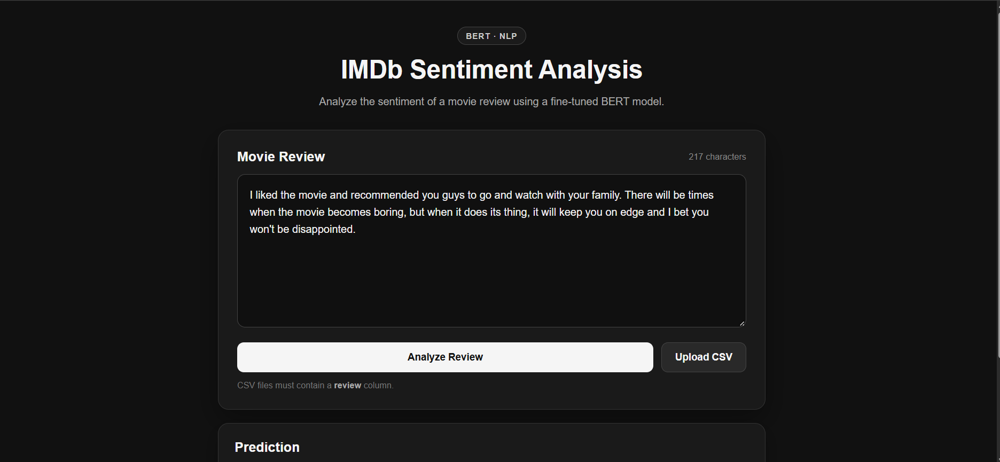
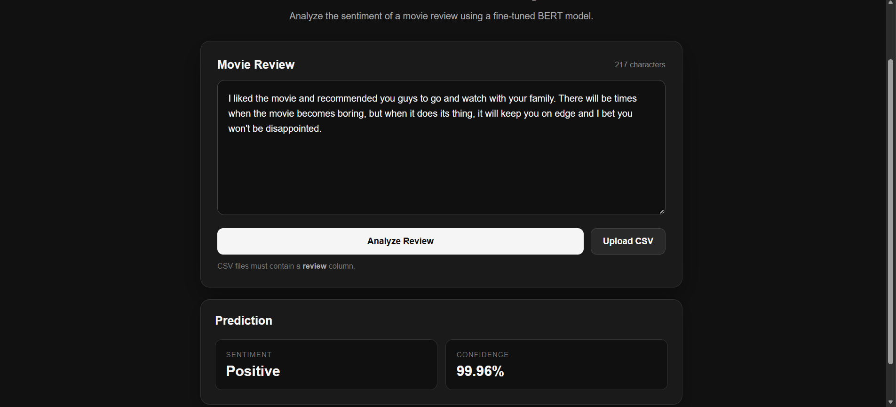
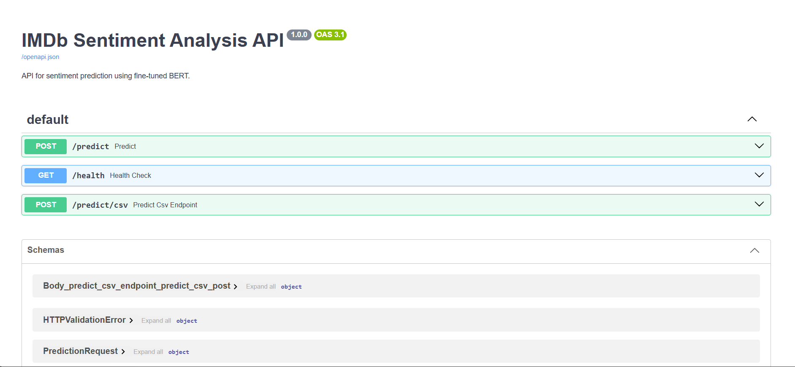

# IMDb Sentiment Analysis

An end-to-end sentiment analysis project using the IMDb movie review dataset.

The project progresses from classical NLP techniques and neural word embeddings to a fine-tuned BERT model, followed by inference API development, automated testing, Docker containerization, CI/CD, and cloud deployment.

---
## Project Demo

The application provides an interactive web interface for sentiment prediction, along with REST API endpoints for single-review and CSV batch inference.

### Web Application



The application allows users to enter a movie review and submit it for sentiment analysis.



The fine-tuned BERT model returns the predicted sentiment along with its confidence score.

### Swagger API Documentation

FastAPI provides interactive API documentation for the prediction endpoints.



---

## Overview

The project evaluates multiple approaches for binary sentiment classification:

- Bag of Words
- TF-IDF
- Word2Vec
- FastText
- Doc2Vec
- BERT

The final BERT model is integrated into a FastAPI application supporting single-review and CSV batch inference.

The application includes request validation, error handling, logging, automated testing, Docker support, CI/CD, and AWS deployment.

---

## Project Highlights

- Exploratory data analysis and preprocessing
- Fixed train/validation/test split
- Comparison of classical NLP representations and word embeddings
- Fine-tuned BERT for sentiment classification
- Evaluation using accuracy, precision, recall, and F1
- BERT error analysis
- Single-review inference
- CSV batch inference
- Pydantic request validation
- Exception handling and logging
- Automated testing with pytest
- Dockerized FastAPI application
- GitHub Actions CI/CD
- Amazon ECR image registry
- AWS EC2 deployment
- AWS Systems Manager based deployment
- Post-deployment health checks
- Interactive Swagger API documentation

---

## Dataset

The IMDb dataset contains 50,000 movie reviews labeled as `positive` or `negative`.

Dataset split:

- 72% training
- 8% validation
- 20% testing

The same fixed split was used across experiments, with the test set reserved for final evaluation.

---

## Model Comparison

Results on the fixed test set:

| Model | Accuracy | Precision | Recall | F1 |
|---|---:|---:|---:|---:|
| Bag of Words | 90.28% | 89.90% | 90.84% | 90.37% |
| TF-IDF | 89.59% | 88.56% | 91.02% | 89.77% |
| Doc2Vec | 89.33% | 89.82% | 88.81% | 89.31% |
| Word2Vec | 88.19% | 87.91% | 88.67% | 88.29% |
| FastText | 88.19% | 87.97% | 88.59% | 88.28% |
| **BERT** | **92.49%** | **92.46%** | **92.59%** | **92.52%** |

These results reflect this particular experimental setup and are not intended as universal comparisons between the techniques.

---

## BERT

### Configuration

- Maximum sequence length: `256`
- Epochs: `2`
- Learning rate: `2e-5`
- Batch size: `8`
- Model: BERT fine-tuned for binary sequence classification

### Final Test Performance

- Accuracy: **92.49%**
- Precision: **92.46%**
- Recall: **92.59%**
- F1: **92.52%**

The trained model is excluded from Git because of its size.

For local inference, the model is expected at:

```text
models/bert_imdb_80_20_split_final/
````

The deployed application downloads the model from Hugging Face at runtime using the configured model path.

---

## BERT Error Analysis

Confusion matrix:

```text
[[4564, 376],
 [ 369, 4608]]
```

Review-length analysis showed:

- 43.30% of test reviews contained more than 256 tokens.
- 58.93% of model errors involved reviews longer than 256 tokens.
- Error rate for reviews >256 tokens: 10.22%.
- Error rate for reviews ≤256 tokens: 5.44%.

This shows an association between longer reviews and higher error rates in this experiment, but does not establish sequence truncation as the direct cause.

Other error patterns included:

- Mixed or conflicting sentiment
- Sarcasm and irony
- Nuanced reviews
- Misleading phrases without broader context
- Potentially ambiguous labels

---

## Software Engineering

The project was extended beyond model training into an end-to-end ML application.

### Inference Layer

The trained BERT model is loaded through a dedicated inference component responsible for:

- Tokenization
- Model inference
- Sentiment prediction
- Confidence calculation
- Input validation
- Batch inference

### FastAPI

The inference logic is exposed through REST API endpoints.

The API includes:

- Request schemas using Pydantic
- Input validation
- Exception handling
- Logging
- Single-review prediction
- CSV batch prediction
- Health check endpoint
- Automatic Swagger documentation

---

## API

### Health Check

```http
GET /health
```

Response:

```json
{
  "status": "healthy"
}
```

### Single Prediction

```http
POST /predict
```

Request:

```json
{
  "text": "This movie was absolutely fantastic!"
}
```

Response:

```json
{
  "sentiment": "Positive",
  "confidence": 0.9994
}
```

### CSV Batch Prediction

```http
POST /predict/csv
```

Upload a CSV containing a `review` column.

The API returns the original reviews with:

- `predicted_sentiment`
- `confidence`

---

## Testing

The project uses `pytest` for automated testing.

Run the complete test suite:

```bash
python -m pytest
```

Current result:

```text
21 passed, 1 warning
```

Tests cover:

- API endpoints
- Request validation
- Error handling
- CSV upload and validation
- Batch prediction
- Inference logic

Mocking is used where appropriate to isolate components and avoid unnecessary model inference during unit tests.

---

## Docker

The FastAPI application is containerized using Docker.

### Build the Image

```bash
docker build -t imdb-sentiment-api .
```

### Local Run

For local development, the trained model can be mounted into the container:

```powershell
docker run --rm -p 8000:8000 -v "${PWD}\models\:/app/models" imdb-sentiment-api
```

For cloud deployment, the large model artifact is not included in the Docker image. The application receives the model identifier through the `MODEL_PATH` environment variable and downloads the model from Hugging Face at runtime.

This keeps the application image smaller and separates the application image from the model artifact.

---

## CI/CD

GitHub Actions is used to automate testing, Docker image building, and deployment.

The workflow:

1. Runs the test suite on pushes and pull requests.
2. Builds the Docker image on pushes to `main`.
3. Pushes the image to Amazon ECR.
4. Uses AWS Systems Manager to deploy the image to EC2.
5. Starts the new Docker container.
6. Runs a `/health` check before marking the deployment successful.

GitHub authenticates with AWS using OpenID Connect (OIDC), avoiding long-lived AWS access keys in the repository.

---

## Deployment

The application is deployed as a Dockerized FastAPI service on an AWS EC2 instance.

### Deployment Architecture

```text
Git Push
   ↓
GitHub Actions
   ↓
Run Tests
   ↓
Build Docker Image
   ↓
Amazon ECR
   ↓
AWS Systems Manager
   ↓
EC2
   ↓
Docker Container
   ↓
FastAPI + BERT
   ↓
Health Check
```

### AWS Components

- **Amazon EC2** — hosts the containerized application
- **Amazon ECR** — stores Docker images
- **AWS Systems Manager (SSM)** — executes deployment commands on EC2
- **AWS IAM** — controls AWS permissions
- **GitHub OIDC** — provides secure GitHub Actions authentication to AWS

The deployment is triggered automatically when changes are pushed to the `main` branch.

A post-deployment health check verifies that the FastAPI application is responding successfully before the deployment is marked as successful.

---

## Project Structure

```text
sentiment-analysis-imdb/
│
├── .github/
│   └── workflows/
│       └── deploy.yml
│
├── config/
│   └── settings.py
│
├── data/
│   ├── raw/
│   └── processed/
│
├── frontend/
│   ├── index.html
│   ├── script.js
│   └── style.css
│
├── models/
│   └── ...
│
├── notebooks/
│   ├── 01_eda_and_data_split.ipynb
│   ├── 02_bow_and_tfidf.ipynb
│   ├── 03_word2vec_fasttext_doc2vec.ipynb
│   ├── 04_bert.ipynb
│   └── 05_model_comparison.ipynb
│
├── results/
│   ├── bert_results.csv
│   ├── bow_tfidf_results.csv
│   └── word_embeddings_results.csv
│
├── src/
│   ├── api.py
│   ├── batch_inference.py
│   ├── inference.py
│   └── logging_config.py
│
├── tests/
│   ├── test_api_csv.py
│   ├── test_api_predict.py
│   ├── test_batch_csv.py
│   ├── test_batch_predictions.py
│   └── test_inference.py
│
├── .dockerignore
├── .gitignore
├── Dockerfile
├── README.md
└── requirements.txt
```

---

## Running Locally

### 1. Clone the Repository

```bash
git clone https://github.com/roshanchouhan-ai/bert-sentiment-analysis.git
cd bert-sentiment-analysis
```

### 2. Install Dependencies

```bash
pip install -r requirements.txt
```

### 3. Place the Trained Model

Place the trained model at:

```text
models/bert_imdb_80_20_split_final/
```

### 4. Start the API

```bash
python -m uvicorn src.api:app --reload
```

Application:

```text
http://127.0.0.1:8000
```

Swagger documentation:

```text
http://127.0.0.1:8000/docs
```

---

## Technologies

### Machine Learning & NLP

- Python
- PyTorch
- Hugging Face Transformers
- Scikit-learn
- Gensim
- Pandas
- NumPy

### Backend & Testing

- FastAPI
- Pydantic
- Pytest

### Deployment & DevOps

- Docker
- Git
- GitHub Actions
- Linux
- AWS EC2
- Amazon ECR
- AWS Systems Manager
- AWS IAM
- GitHub OIDC

### Development

- Jupyter Notebook

---

## What This Project Demonstrates

This project goes beyond training a machine learning model.

It demonstrates the workflow of taking an NLP model from experimentation to a usable, deployed application:

```text
Data
 ↓
EDA & Preprocessing
 ↓
Classical NLP Experiments
 ↓
Embedding Experiments
 ↓
BERT Fine-tuning
 ↓
Evaluation & Error Analysis
 ↓
Inference Pipeline
 ↓
FastAPI
 ↓
Validation & Error Handling
 ↓
Automated Testing
 ↓
Docker
 ↓
CI/CD
 ↓
Cloud Deployment
 ↓
Post-deployment Health Check
```

The project provided practical exposure to both **machine learning development** and the **software engineering required to serve and deploy a machine learning model as an application**.

---

## Future Improvements

Potential future improvements include:

- API authentication
- HTTPS and custom domain
- Rate limiting
- Performance and load testing
- Centralized monitoring and observability
- Model versioning and model registry
- Automated rollback
- Longer sequence-length experiments
- Production-grade model serving and scaling
- Model drift monitoring

```
